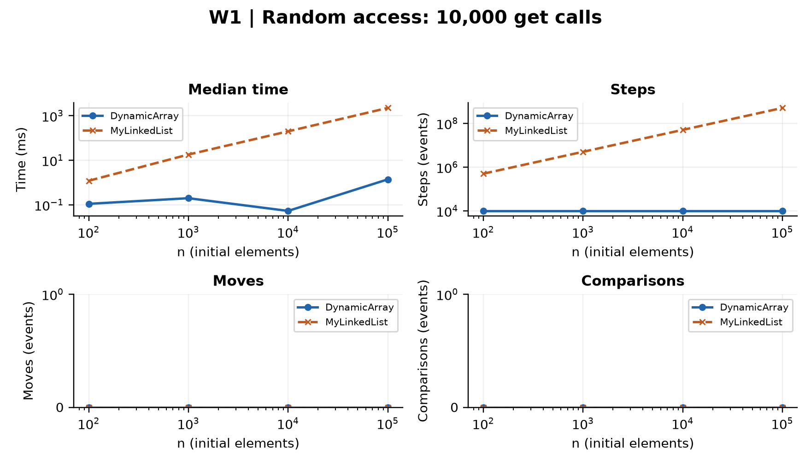
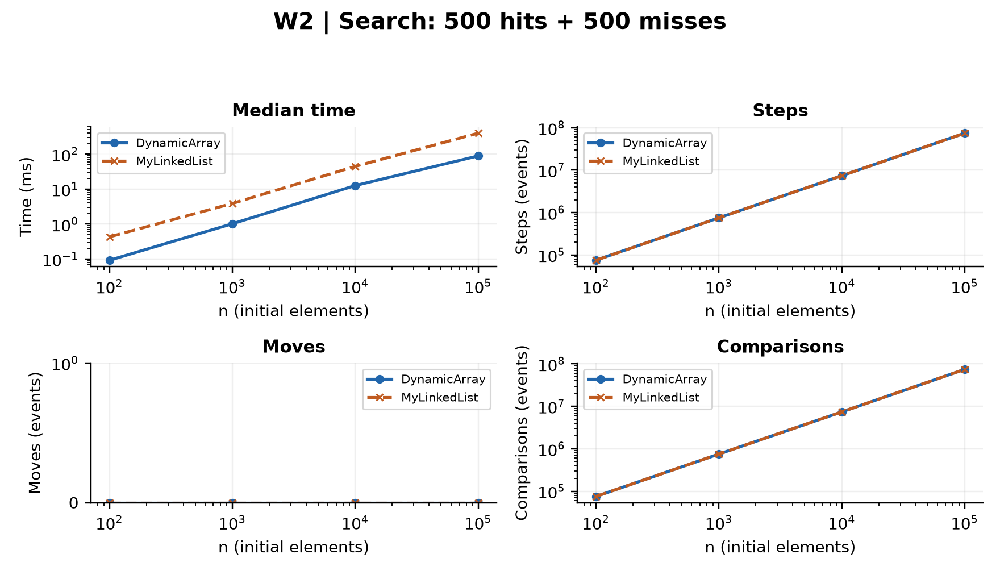
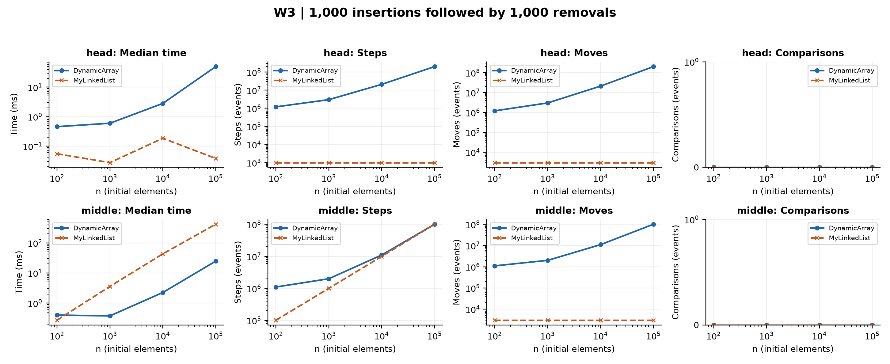
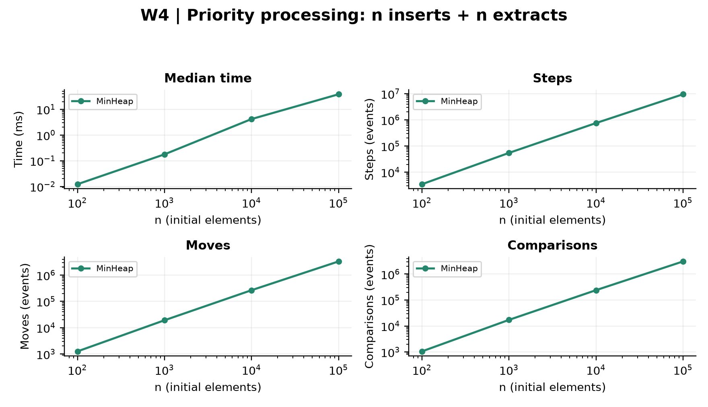
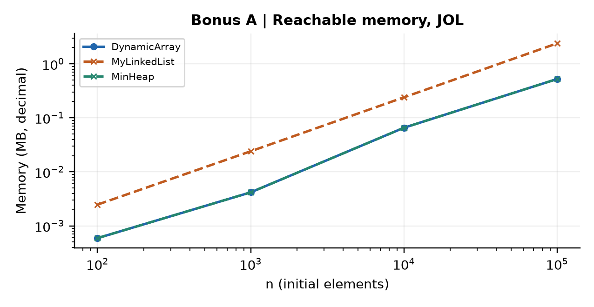
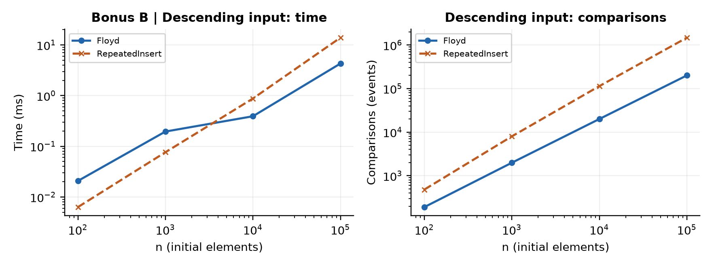
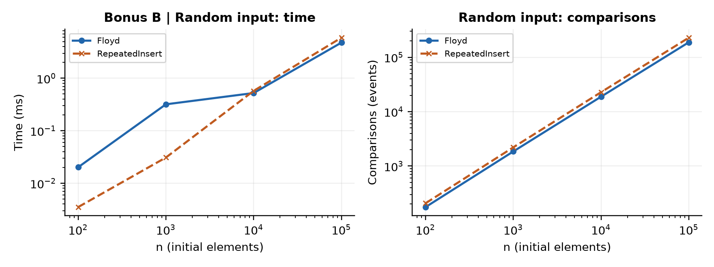

# DAA Assignment 2 - Data Structures

**Yerzhan Moldir | SE-2509 | 04 October 2026**

Five-page submission: REPORT.pdf. This Markdown version provides the same analysis and full-size figures.

## Complexity

| Operation | Best | Average | Worst | Extra | Justification |
|---|---|---|---|---|---|
| DynamicArray.add(x) | Θ(1) | Θ(1)* | Θ(n) | Θ(n) | Full buffer copies n ints; doubling gives amortized Θ(1). |
| DynamicArray.add(i,x) | Θ(1) | Θ(n) | Θ(n) | Θ(n) | Uniform i shifts n/2 values on average; growth may copy n. |
| DynamicArray.remove(i) | Θ(1) | Θ(n) | Θ(n) | Θ(1) | Shifts n-i-1 values; the array does not shrink. |
| DynamicArray.get(i) | Θ(1) | Θ(1) | Θ(1) | Θ(1) | One checked array read, independent of i. |
| DynamicArray.contains(x) | Θ(1) | Θ(n) | Θ(n) | Θ(1) | First match stops; uniform hit or a miss examines Θ(n). |
| MyLinkedList.add(x) | Θ(1) | Θ(1) | Θ(1) | Θ(1) | Tail pointer avoids traversal; allocate one node. |
| MyLinkedList.add(i,x) | Θ(1) | Θ(n) | Θ(n) | Θ(1) | Head and tail cases are constant; other indices traverse. |
| MyLinkedList.remove(i) | Θ(1) | Θ(n) | Θ(n) | Θ(1) | Head is constant; finding the predecessor costs Θ(i+1). |
| MyLinkedList.get(i) | Θ(1) | Θ(n) | Θ(n) | Θ(1) | Exactly i next-link traversals plus constant work. |
| MyLinkedList.contains(x) | Θ(1) | Θ(n) | Θ(n) | Θ(1) | Scan until match or null; uniform hit/miss model. |
| MinHeap.insert(x) | Θ(1) | Θ(1)* | Θ(n) | Θ(n) | Swim ≤ log n levels; full backing array adds a linear copy. |
| MinHeap.peekMin() | Θ(1) | Θ(1) | Θ(1) | Θ(1) | Read the root after checking non-emptiness. |
| MinHeap.extractMin() | Θ(1) | Θ(log n) | Θ(log n) | Θ(1) | Sink at most the height; equal values can stop at the root. |
| MinHeap.buildHeap(a) | Θ(n) | Θ(n) | Θ(n) | Θ(n) | Copy n values; bottom-up work sums to O(n). |

n is the current size. Auxiliary space is the peak extra allocation per call; output storage is included for buildHeap. Average indices are uniform; contains uses a fixed positive fraction of misses or uniformly located first hits. Heap averages assume random distinct priorities. *Append Θ(1) is amortized across a sequence; heap insertion Θ(1) is expected-amortized across random-permutation insertions [2], not the cost of a forced resize. Without resizing, the worst heap insertion is Θ(log n); with growth the amortized worst-case bound is O(log n). Stored space: list Θ(n); array/heap Θ(capacity), or Θ(peak n) because no shrinking occurs. size() and metrics() are Θ(1) in all cases; diagnostic snapshot() is Θ(n) time and output space.

## Loop-invariant proofs

### DynamicArray.contains(x)

**Invariant:** Let A be the unchanged array contents and n the size at entry. Before iteration i of DynamicArray.contains(x), 0 ≤ i ≤ n and every A[j] with 0 ≤ j < i differs from x.

**Initialization:** At i=0 the examined prefix is empty, so the statement holds vacuously.

**Maintenance:** The loop compares A[i] with x. If equal, returning true is correct because a witness exists. Otherwise A[i] also differs from x; incrementing i extends the verified prefix by one and preserves the invariant.

**Termination:** Each non-returning iteration decreases n-i. At normal exit i=n, the invariant covers every stored element, so returning false is correct. An early return has already supplied a matching element.

**Conclusion:** Every exit reports membership correctly, and the finite decreasing variant ensures termination. The array and size are unchanged.

### DynamicArray.remove(k)

**Invariant:** Let A be the original contents, n the original size and k the validated removal index. Before shift iteration i, k ≤ i ≤ n-1; entries j<k equal A[j], entries k ≤ j<i equal A[j+1], and entries i ≤ j<n still equal A[j]. The saved removed value equals A[k].

**Initialization:** At i=k no entry has been shifted, the shifted interval is empty, and the method has saved A[k]. All other entries still match A.

**Maintenance:** For i<n-1, cell i+1 still contains A[i+1]. Assigning it to cell i gives the correct replacement; incrementing i extends the shifted interval. The prefix before k and the unprocessed suffix remain unchanged.

**Termination:** The integer n-1-i decreases each iteration. At exit i=n-1, the prefix [0,k) is unchanged and [k,n-1) contains A[k+1..n). Decrementing size discards the final redundant slot.

**Conclusion:** The result is precisely the original sequence without index k, in the original order, and the returned value is A[k]. Bounds checking also makes invalid input fail before mutation.

## Methodology and validation

Maven/JUnit 5: 11 tests pass, including 48,000 randomized sequence operations and 20,000 mixed heap operations, plus edge cases, sorted extraction, growth and exact small counter checks. Heap order is checked after every tested insert/extract. Benchmark: Random(42), n=100/1,000/10,000/100,000, fresh states, 30 global warm-up rounds, then 3 discarded + 5 measured trials per case. Median nanoTime is exported with deterministic counters; 36 medians and 180 raw trials are retained. W1: 10,000 gets; W2: 500 hits + 500 guaranteed negative misses; W3: 1,000 inserts followed by 1,000 removals at fixed 0 or original n/2. W1-W3 exclude filling; W4 includes n inserts and n extracts. Random generation and validation are outside the timed region; returned results are checked and consumed. Environment: Java 25.0.1, Windows 11 amd64.

See README.md for exact counter conventions, timed boundaries, reproducible commands and limitations.

## W1

## W2

## W3

## W4

## Bonus A: memory

At n=100,000 the array and heap occupy 524,368 bytes each, versus 2,400,072 bytes for the list. A 24-byte node holds a 12-byte header, int (4), reference (4) and alignment padding (4). The array capacity is 131,072. JOL includes the constant-size Metrics object. Attach-enabled layout details and object footprints are saved; these figures are JVM-specific, not universal.

## Bonus B: Floyd buildHeap

Floyd repairs parents from n/2-1 down to 0, after copying the input. At height h there are O(n/2^(h+1)) nodes, so total repair work is O(n) and copying gives a matching lower bound. Repeated insertion is Θ(n log n) on descending priorities but expected Θ(n) total on a random permutation [2]. Both orders are measured, including allocation and input copying. At n=100,000 descending input, comparison counts are 199,978 versus 1,468,946.

## Discussion (15 sentences)

At n=100,000, W1 took 1.386 ms for DynamicArray and 2227.131 ms for MyLinkedList. The array reads one indexed cell, whereas the list follows approximately i links to reach index i. Sequential array scans also benefit from contiguous int storage, so a fetched cache line can serve several neighboring values. List traversal depends on the previous node address and can stall on pointer chasing even for a linear-time algorithm. W2 took 89.320 versus 398.390 ms despite similar linear comparison counts. Node object headers, alignment and references enlarge the working set, while allocation and garbage collection can add variability. The benchmark supports this locality explanation but does not directly measure cache misses or isolate GC costs. For W3 at the head, the list took 0.038 ms versus 49.856 ms because it rewires links without shifting a suffix. At the middle, the list took 417.086 ms versus 24.718 ms because index lookup must traverse the prefix. The head workload has constant list work per operation; array work also depends on the temporary 1,000-element increase. The list is useful for head updates and tail appends, but removing its tail still requires finding the predecessor. MinHeap completed W4 in 38.368 ms and suits repeated minimum-priority extraction rather than arbitrary indexed lookup. Instrumented single-JVM timings include counter overhead and OS noise, so small-size reversals are not asymptotic evidence. Floyd construction guarantees linear work by summing node heights, while descending-input repeated insertion requires Θ(n log n) comparisons. Random insertion can have linear expected total work, so the bonus includes descending input as well as random data rather than claiming a logarithmic gap for every input.

## Sources

1. [Sedgewick and Wayne: Priority Queues](https://algs4.cs.princeton.edu/24pq/).
2. [Bollobás and Simon: Repeated random insertion into a priority queue (1985)](https://digitalcommons.memphis.edu/facpubs/5607/).
3. DAA_Assignment2_Data_Structures.pdf, supplied assignment specification.
4. JOL 0.17 measurements: results/memory.csv, jol_environment.txt and memory_footprints.txt; benchmark evidence: results/results.csv and raw_runs.csv.
